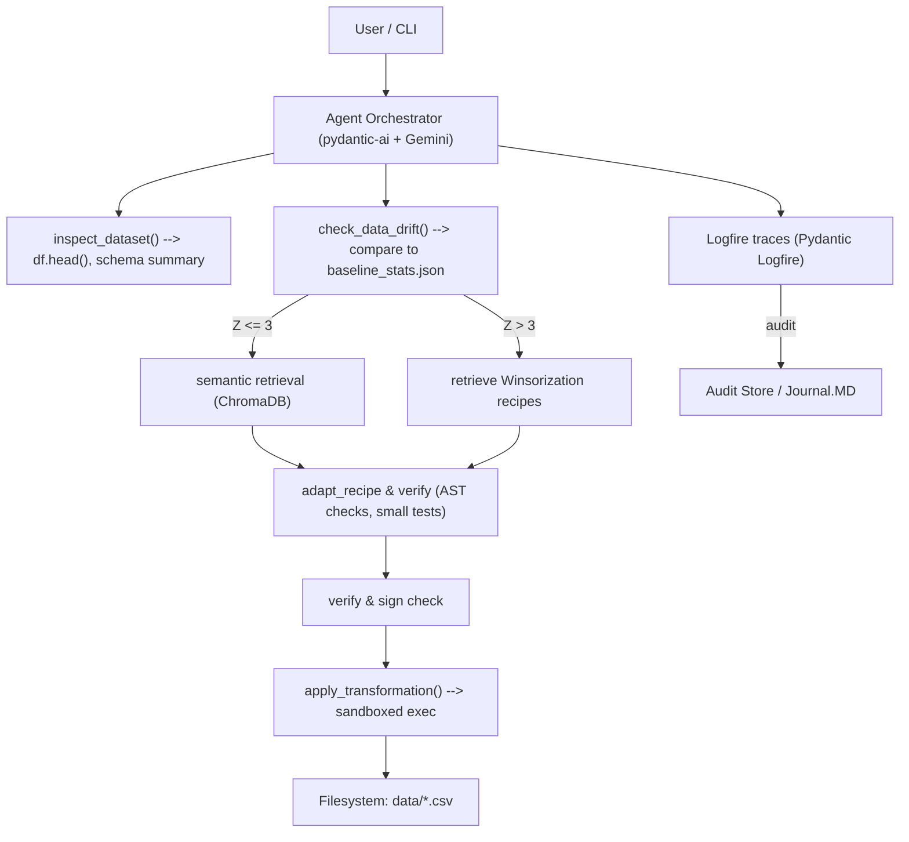

# 🤖 Agentic-Data-MLOps — Retrieval-Augmented Generation (RAG) Agent


📚 Table of Contents
- [🧭 Overview](#overview)
- [🆕 What's new (v1.3)](#whats-new-v13)
- [🗺️ High-level flow & diagrams](#high-level-flow--diagrams)
  - [🧩 Mermaid flowchart](#mermaid-flowchart)
  - [🖥️ ASCII architecture](#ascii-architecture)
- [⚙️ New Feature: Statistical Guardrails](#new-feature-statistical-guardrails)
- [🏗️ The 5-Layer Architecture](#the-5-layer-architecture)
- [🔧 Primary components & runtime flow](#primary-components--runtime-flow)
- [📁 Repository layout & related repositories](#repository-layout--related-repositories)
- [🚀 Quickstart — run locally (RAG + Guardrails)](#quickstart--run-locally-rag--guardrails)
- [🔒 Security & safety (important)](#security--safety-important)
- [👀 Observability & quotas](#observability--quotas)
- [✨ Extending the project](#extending-the-project)
- [🤝 Contributing](#contributing)
- [📄 License & contact](#license--contact)

<a name="overview"></a>
## 🧭 Overview
Agentic-Data-MLOps implements a Retrieval-Augmented Generation (RAG) agent designed for deterministic, auditable data transformations. The agent grounds its reasoning in a curated recipe knowledge store and enforces a statistical gateway to prevent silent data failures.

<a name="whats-new-v13"></a>
## 🆕 What's new (v1.3)
- Formalized "Statistical Gateway" protocol and explicit guardrail behaviors.
- Added a concise "Extending the project" note for adding recipes and CI/CD next steps.
- Minor clarifications to quickstart and verification steps.

<a name="high-level-flow--diagrams"></a>
## 🗺️ High-level flow & diagrams

<a name="mermaid-flowchart"></a>
### 🧩 Mermaid flowchart 


<a name="ascii-architecture"></a>
### 🖥️ ASCII architecture 
```
User/CLI
   │
   ▼
+----------------------------------+
|  Agent Orchestrator (O2)         |
|  - pydantic-ai wiring            |
|  - Gemini (gemini-flash-latest)  |
|  - System prompt enforces gateway|
+----------------------------------+
   │         │           │
   │         │           ▼
   │         │     +------------------------------+
   │         │     |  ChromaDB                    |
   │         │     | transformation_recipes (O1)  |
   │         │     +------------------------------+
   │         ▼
+----------------------+     +---------------------------------+
|  Statistical Monitor |<----| baseline_stats.json             |
|  (Z-score checks O4) |     | (generated by data_baseline.py) |
+----------------------+     +---------------------------------+
   │
   ▼
+-----------------------------+
|  Execution (O3)             |
|  - apply_transformation()   |
|  - sandboxed subprocess     |
+-----------------------------+
   │
   ▼
Pydantic Logfire traces & Journal.MD (O5)
```

<a name="new-feature-statistical-guardrails"></a>
## ⚙️ New Feature: Statistical Guardrails
The agent operates under a "Statistical Gateway" protocol to prevent silent data failures. Implementation details and behaviors are summarized below:

- Drift Discovery:
  - Before any transformation, the agent runs check_data_drift() to calculate Z-scores comparing live data to baseline_stats.json.
  - Calculation uses the observed mean and baseline mean/std with standard error scaling (z = |current_mean - baseline_mean| / (baseline_std / sqrt(n))).
  - Thresholding: Z > 3 is treated as "High-Severity Drift" and triggers remediation.

- Automated Remediation:
  - If extreme drift (Z > 3) is detected, the agent autonomously retrieves Winsorization (Outlier Capping) recipes from the knowledge base (ChromaDB-backed memory_store.json).
  - The agent adapts the retrieved Winsorization recipe (e.g., capping at the 5th/95th percentiles) and includes remediation in the synthesized one-shot transformation.
  - Journal.MD contains examples and traces showing successful remediation (e.g., capping applied and subsequent successful run).

- Grounded Reasoning:
  - Discovery tools (inspect_dataset) provide raw data samples (df.head()) and a compact schema summary so agent decisions are grounded in actual record values rather than purely metadata.
  - The system prompt enforces the "Mandatory Gateway" sequence: inspect_dataset() and check_data_drift() must be used before retrieval or transformations.

<a name="the-5-layer-architecture"></a>
## 🏗️ The 5-Layer Architecture
The project formalizes responsibilities into five layers demonstrated across the repository:

- O1 — Memory:
  - Persistent, vector-backed knowledge using ChromaDB and recipes in memory_store.json.

- O2 — Reasoning:
  - Type-safe agent orchestration using pydantic-ai and Gemini (gemini-flash-latest) executing a ReAct-style loop under an enforced operational protocol.

- O3 — Execution:
  - Verified transformation sandbox. The prototype uses apply_transformation() to exec() adapted code against pandas DataFrames and persist artifacts.

- O4 — Monitoring:
  - Automated statistical drift detection via check_data_drift() comparing to baseline_stats.json. Triggers remediation workflows (Winsorization) when needed.

- O5 — Observability:
  - Full-stack tracing and audits using Pydantic Logfire and human-readable run journals (Journal.MD).

<a name="primary-components--runtime-flow"></a>
## 🔧 Primary components & runtime flow
1. inspect_dataset(path) — sample rows (df.head()) and return a concise schema/sample summary.
2. check_data_drift() — computes Z-scores for baseline comparison; emits drift report.
3. retrieval — embed observation and query ChromaDB for top-k recipe vectors.
4. adapt & verify — agent adapts retrieved recipes to the dataset, runs verification checks and unit tests.
5. apply_transformation(python_code) — executes in a controlled environment and writes cleaned artifacts.
6. observability — Logfire captures each reasoning turn and execution trace; Journal.MD persists human-readable outcomes.

<a name="repository-layout--related-repositories"></a>
## 📁 Repository layout & related repositories
Core files discovered:
- reasoning.py — agent wiring, tools: inspect_dataset, check_data_drift, apply_transformation, model init, Logfire integration.
- data_baseline.py — baseline_stats.json generator.
- memory_store.json — canonical recipes.
- chroma_db/ — persistent ChromaDB data directory.
- Journal.MD / Architecture.MD — experiments, traces, and drift writeups.
- test_tools.py — local pre-flight checks.
- data_corruption_script.py — test scenario to inject drift.

Recommended repo split for scaling (optional):
- ravirik/agentic-core
- ravirik/agentic-recipes
- ravirik/agentic-indexer
- ravirik/agentic-exec
- ravirik/agentic-observability

<a name="quickstart--run-locally-rag--guardrails"></a>
## 🚀 Quickstart — run locally (RAG + Guardrails)
1. Clone:
   ```bash
   git clone https://github.com/ravirik/Agentic-Data_ML_Ops-Project.git
   cd Agentic-Data_ML_Ops-Project
   ```

2. Create virtualenv & install:
   ```bash
   python -m venv .venv
   source .venv/bin/activate
   pip install -r requirements.txt
   ```

3. Add credentials to `.env`:
   ```
   LOGFIRE_ENABLED=true
   GOOGLE_API_KEY=...
   CHROMA_PERSIST_DIR=./chroma_db
   ```

4. Prepare baseline (one-time):
   ```bash
   python data_baseline.py
   ```
   - Produces `baseline_stats.json`.

5. (Optional) Inject test drift:
   ```bash
   python data_corruption_script.py
   ```

6. Index recipes (one-time):
   ```bash
   python scripts/index_recipes.py --input memory_store.json --chroma-dir ./chroma_db
   ```

7. Verify & pre-flight:
   ```bash
   python verify_agent.py
   python test_tools.py
   ```

8. Run example RAG cycle:
   ```bash
   python agent_reasoning.py
   ```

<a name="security--safety-important"></a>
## 🔒 Security & safety (important)
- Prototype uses exec() in apply_transformation() — unsafe for untrusted code.
- Hardening recommendations:
  - AST whitelisting and node-level validation.
  - Run transformations in sandboxed subprocesses/containers with resource caps and no network.
  - Verify recipe signatures and require signed/approved recipes for execution.
  - Add golden-case unit tests per recipe and run them pre-execution.

<a name="observability--quotas"></a>
## 👀 Observability & quotas
- Pydantic Logfire integration captures agent reasoning and execution. Journal.MD and public Logfire traces provide reproducibility and audit trails.
- UsageLimits: agent enforces a strict 5 RPM ceiling and is designed to complete the Inspect → Drift → Search → Apply cycle in minimal tool calls (goal: ≤4 calls).

<a name="extending-the-project"></a>
## ✨ Extending the project
- New Recipes: Append new recipes to memory_store.json and re-run the indexing/migration script (e.g., scripts/index_recipes.py) to upsert vectors into ChromaDB.
- CI/CD: Future work includes adding GitHub Actions for automated golden-case testing (validate recipes, run index validation, and run sanitized recipe tests without LLM calls).
- Additional extensions: scaffold hardened execution runner, expand recipe metadata and signatures, or add human-in-the-loop approvals for high-severity drift actions.

<a name="contributing"></a>
## 🤝 Contributing
1. Open an issue describing the change.
2. Branch from `main`, implement, and create a PR.
3. Include tests and documentation for any behavior changes.

<a name="license--contact"></a>
## 📄 License & contact
Apache-2.0 — see `LICENSE`

Maintainer: @ravirik
